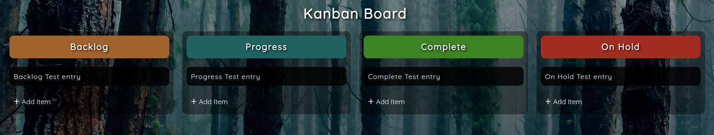

# basicJS_Kanban Board: [LIVE DEMO](https://shcoobz.github.io/basicJS_kanban-board/)

## Summary

The basicJS_Kanban Board provides a visual management tool to create, organize, and prioritize tasks in a flexible and responsive web interface. It features an intuitive drag-and-drop functionality that allows users to easily move tasks between different stages of their workflow.

The core functionality includes:

- Real-time task editing and updating.
- Persistent storage of tasks using browser's localStorage.
- Four distinct columns for task stages: Backlog, In Progress, Complete, and On Hold.

## Features

### Drag and Drop Functionality

Allows users to drag tasks across different columns representing different stages of completion, making task management dynamic and efficient.

### Persistent Storage

Utilizes the browser's localStorage to save the state of the board, ensuring that the user's data is preserved between sessions.

### Real-Time Task Editing

Users can edit tasks directly on the board and see updates instantaneously, which enhances the usability and interactivity of the application.

### User-Friendly Interface

The application has a simple and clean interface that is easy to navigate, making it suitable for both beginners and experienced users.

## Technologies

- HTML/CSS: Provides the structure and style of the application.
- JavaScript: Manages the application's functionality including drag-and-drop, localStorage integration, and DOM manipulation.

---

_Note: This document provides an overview of the basicJS_Kanban Board. For detailed instructions and more information, please refer to the source code documentation._
